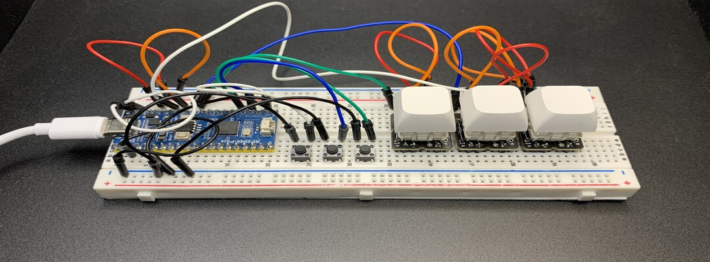
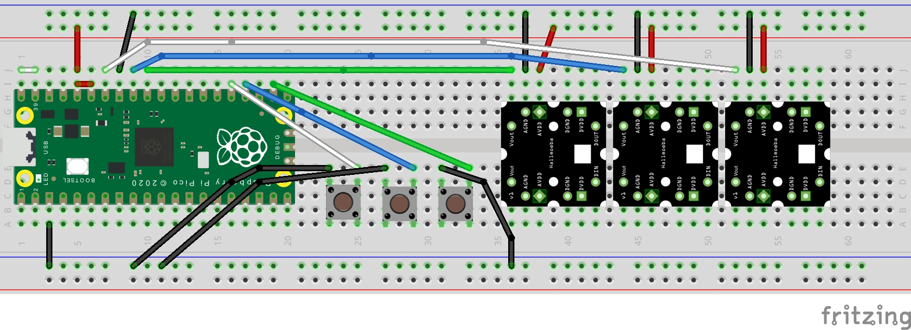

# QMK-Powered Breadboard Keypad with Rapid Trigger \[RP2040 Build Guide\]

### **Required Components:**

*   Breadboard-ready Hallmoebas
*   [Gateron Magnetic Switches](https://www.gateron.com/products/gateron-ks-20-magnetic-white-switch-set?VariantsId=10680) 
*   Keycaps
*   [830-point Breadboard](https://www.google.com/search?q=830+point+breadboard)
*   RP2040 MCU Board + Corresponding USB cable ([RP-Pico](https://www.raspberrypi.com/products/raspberry-pi-pico/) uses microUSB, but USB-C breakouts for the RP2040 can be found.)
*   [Male to Male Jumper Wires](https://www.google.com/search?q=male+to+male+jumper+wires)
*   [Through-hole SPST Tactile Switches  
    ](https://www.google.com/search?q=through+hole+spst+tactile+switch)\*If you don't want to buy buttons, you can also use open-ended wires connected to the MCU and pull those to ground whenever you want to "press" a button.  
*   Adhesive to hold the magnetic switches onto the Hallmoebas, since the switches cannot be soldered. We recommend a washable adhesive such as [Elmer's washable school glue](https://www.google.com/search?q=elmer%27s+washable+school+glue) so that the components can be reused. 
*   (_Optional_) Non-slip rubber stickers to keep the keypad from moving  

### **Wiring**

  

### **Firmware**

Download: [https://raw.githubusercontent.com/gamaPhy/qmk-keyboards/main/release/freedom/3k/via/gamaphy\_freedom\_3k\_via.uf2](https://raw.githubusercontent.com/gamaPhy/qmk-keyboards/main/release/freedom/3k/via/gamaphy_freedom_3k_via.uf2)

Source: [https://github.com/gamaPhy/qmk-keyboards/releases/tag/latest](https://github.com/gamaPhy/qmk-keyboards/releases/tag/latest)

### **Keypad Calibration**

1.  Load the firmware onto the RP-2040 board
2.  While keeping the calibration button held down (right button), press all the keys through their maximum range of motion. The LED on the Pico will turn on while in calibration mode, and will turn off after calibration is computed.
3.  Release the calibration button

### **(Optional) Reading Keypad Debug Logs**

1.  Download [qmk toolbox](https://github.com/qmk/qmk_toolbox/releases)
2.  Start qmk toolbox, and open the HID Console 
    
3.  You should see debug messages in the HID console. 
    

### **Configuration Instructions**

1.  Use the [VIA webapp  
    ](https://usevia.app/ "via webapp")\*Or if you prefer not using web-serial, download VIA from source: [https://github.com/the-via/releases/releases](https://github.com/the-via/releases/releases)
2.  Download the following VIA draft file by right-clicking, and pressing "Save link as...":  
                  [https://raw.githubusercontent.com/gamaPhy/qmk-keyboards/main/release/freedom/3k/via/via.json](https://raw.githubusercontent.com/gamaPhy/qmk-keyboards/main/release/freedom/3k/via/via.json)
3.  Navigate to the "design" tab (paintbrush icon) of the VIA webapp, and load the following via draft file. After loading the draft file, the menu should look like this:  
                                      
4.  Navigate to the "Configure" tab and select the IC icon in the bottom left to change actuation settings. (_There may be more settings present for you if the \`via.json\` was updated since the creation of these instructions_)  
                                    

### **Debugging**

*   If the keypad is spamming keys even after calibration, the firmware may be corrupted. To fix this, follow [RasberryPi's instructions on resetting flash memory](https://www.raspberrypi.com/documentation/microcontrollers/raspberry-pi-pico.html#resetting-flash-memory).
*   The hall effect sensors are sensitive to temperature drift. Temperature drift compensation has not been implemented, so if the ambient temperature changes by too much, the board may need to be recalibrated. To see how much drift has occurred, you can look at the HID console to see how much the \`min calibrated range\` differs from the \`current reading range\` while keys are not pressed.
*   If the temperature drift is still a problem, the [DRV5056A3QDBZR](https://www.ti.com/lit/ds/symlink/drv5056.pdf?ts=1709848637493&ref_url=https%253A%252F%252Fwww.google.com%252F) hall-effect sensor may be better because it has temperature drift compensation built in.
